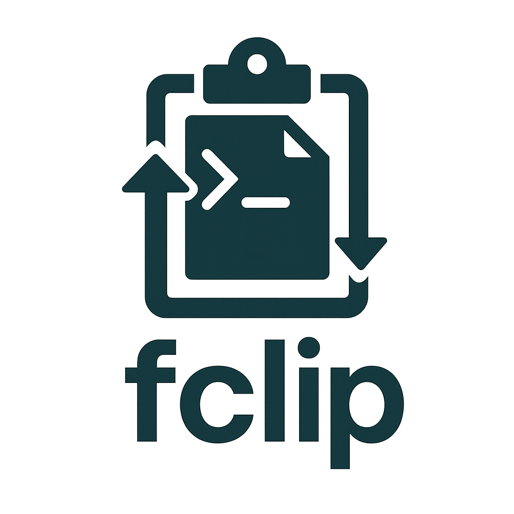

<div align="center">
  
  <p>A simple file clipboard system for the terminal that allows you to copy, paste, and move files and directories between different terminal sessions.</p>

[](https://opensource.org/licenses/MIT)

</div>

## Commands

- `fcopy <file_or_directory>` - Copy a file or directory to the clipboard
- `fpaste` - Paste the copied file or directory to the current directory
- `fmove <file_or_directory>` - Move a file or directory (copy to clipboard and delete original on paste)
- `fstatus` - Show current clipboard contents
- `fclear` - Clear the clipboard

## Installation

Run the installation script:

```bash
./install.sh
```

This will copy the commands to `~/.local/bin/` and provide instructions for adding it to your PATH.

## Usage Examples

```bash
# Copy a file
fcopy example.txt

# In another terminal window/session
fpaste  # Creates example.txt in current directory

# Copy a directory
fcopy my_folder

# Paste the directory
fpaste  # Creates my_folder in current directory

# Move a file (deletes original when pasted)
fmove old_file.txt
fpaste  # Creates old_file.txt here and deletes it from original location

# Check clipboard status
fstatus

# Clear clipboard
fclear
```

## How it works

The system uses a hidden directory `~/.fclip/` to store:
- Copied files/directories in `data/`
- Metadata about the clipboard contents in `info`
- Source path for move operations in `move_source`

Files are actually copied to the clipboard directory, so they persist between terminal sessions and survive system restarts.
